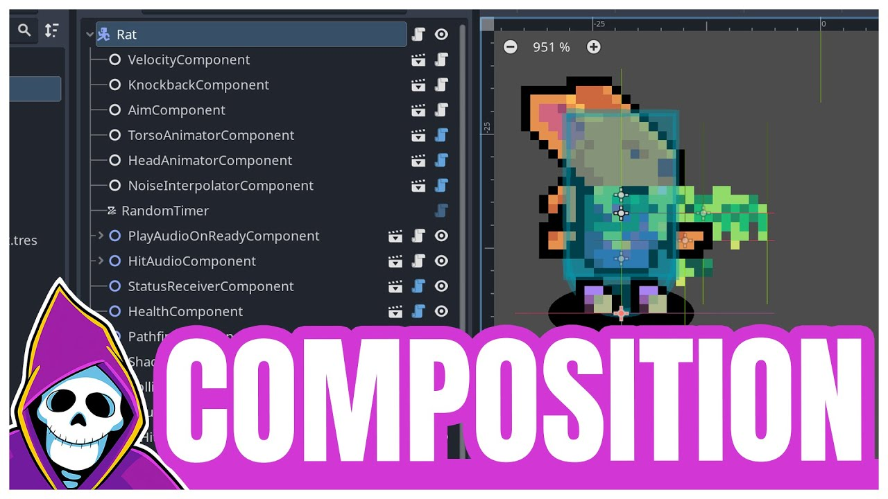

## Godots Reuse Patterns
- ### Node composition
- 
- ### Base Classes
- BaseMover.gd + Derived CLASSES
	- ```python
	  # BaseMover.gd
	  class_name BaseMover
	  extends Node
	  
	  @export var speed: float = 5.0
	  
	  # The shared logic
	  func move(body: CharacterBody3D, direction: Vector3):
	  	body.velocity = direction * speed
	  	body.move_and_slide()
	      
	  
	  ############
	  # PlayerMover.gd
	  class_name PlayerMover
	  extends BaseMover
	  
	  func _physics_process(delta):
	  	var body = get_parent() # Assumes this node is a child of the CharacterBody3D
	  	var input_vec = Input.get_vector("left", "right", "forward", "back")
	  	var direction = (body.transform.basis * Vector3(input_vec.x, 0, input_vec.y)).normalized()
	  	
	  	# Use the inherited function
	  	move(body, direction)
	      
	   ####################   ###########################
	   # NPCMover.gd
	  class_name NPCMover
	  extends BaseMover
	  
	  @onready var nav_agent: NavigationAgent3D = get_parent().get_node("NavigationAgent3D")
	  
	  func _physics_process(delta):
	  	var body = get_parent()
	  	var direction = (nav_agent.get_next_path_position() - body.global_position).normalized()
	  	
	  	# Use the inherited function
	  	move(body, direction)
	   
	  ```
- super
- Use super to extend parent functionality within a child when Overriding otherwise simply use inherited function as above.
- ```python
  # BaseCharacter.gd
  class_name BaseCharacter
  extends CharacterBody3D
  
  var health = 100
  
  func take_damage(amount: int):
  	# This is the core logic
  	health -= amount
  	print(name, " health is now ", health)
      
  ####################################
  # Player.gd
  class_name Player
  extends BaseCharacter
  
  func take_damage(amount: int):
  	# 1. Do the player-specific stuff FIRST.
  	play_hurt_sound()
  	flash_screen_red()
  	
  	# 2. Now, call the parent's version of this exact same function
  	#    to run the original logic without rewriting it.
  	super.take_damage(amount)
  ```
-
- ### Resources
- ```python
  # MovementStats.gd
  class_name MovementStats
  extends Resource
  
  @export var speed: float = 5.0
  @export var acceleration: float = 8.0
  
  #######################################
  # CharacterMover.gd
  class_name CharacterMover
  extends Node
  
  # Drag your MovementStats.tres file here in the Inspector
  @export var stats: MovementStats
  # Drag the appropriate controller node here
  @export var motion_controller: Node 
  
  func _physics_process(delta):
  	var body = get_parent()
  	var direction = motion_controller.get_direction(body) # Get direction from the controller
  	
  	# Use the stats from the resource
  	body.velocity = direction * stats.speed
  	body.move_and_slide()
  ```
- remember Resource.duplicate() since shared pool
-